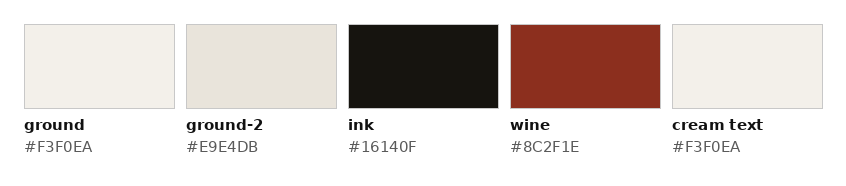
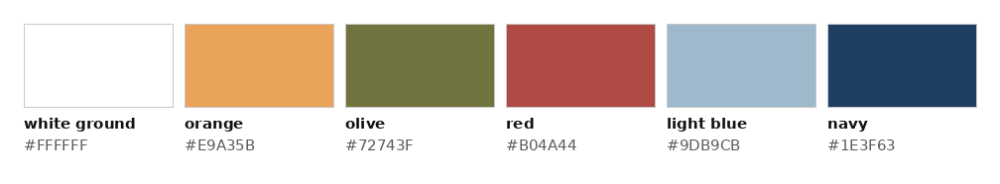
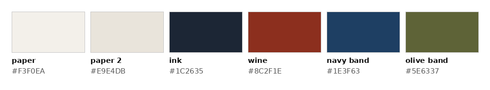
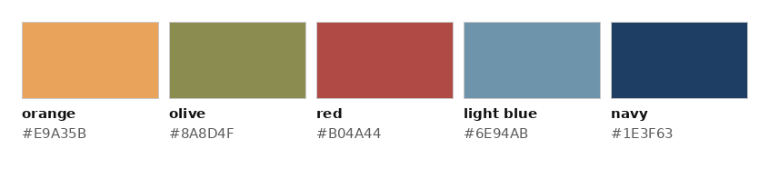
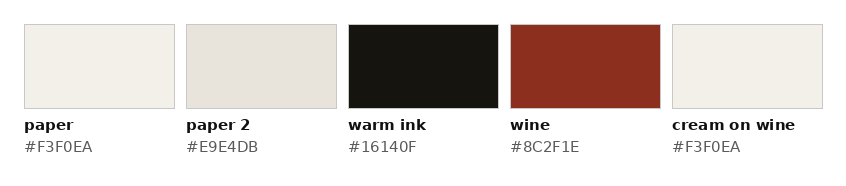
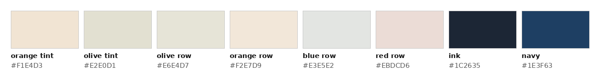

# Themes: colour comparison (prototype only)

Nine palettes for the same pages. **The three colour directions to choose from: Archive, Salon and Campus** (COLOUR-DIRECTIONS.md). **Mono** is the uncoloured build; Cream, Cream bold, Venues, Venues bold and Heritage rich are earlier rounds, kept for reference. **Only colour changes:** type, spacing, images, copy and layout are the same in all five. Checked: every page has the same height in every theme at 1440 and 390, and mono renders as the round-5 build (a pixel comparison shows only sub-pixel anti-aliasing shifts in a few figure captions, where the FIG. number now has its own span, plus frames of animated media).
Squarespace will get **one** palette at the end, set in Site Styles (see SQUARESPACE-BUILD-NOTES.md, *Site Styles per theme*).

- **Switcher:** top-right corner of every prototype page (ARCHIVE · SALON · CAMPUS · MONO, and EARLIER for the previous rounds). The choice is remembered while navigating (localStorage, plus `?theme=` on internal links so it also works where storage is blocked). Any page can be opened in a theme directly, e.g. `index.html?theme=venues-bold`.
- **How it works:** every colour in `site/assets/css/r3.css` is a variable; `data-theme` on `<html>` swaps the set, and in the bold themes each coloured section re-sets the text, rule and link variables for its own ground. This file is generated by `tools/build_themes.py` from the stylesheet.
- **Comparison sheet:** `screenshots/theme-compare.png`, five columns: the whole homepage, project row 01 hovered, the Room 01 header with chapter 02 active, the password page.
- **Contrast, two ways:** (1) the tables below compute every text/ground pair from the CSS values; (2) a rendered audit (`tools/contrast_audit.js`, results in `content/contrast-audit.json`) measures **every piece of text on every page, in every theme, at 1440 and 390** against the pixels actually behind it, which is the only honest check for text on tinted photos. Rule: 4.5:1, or 3:1 for text 24px and larger. Summary at the end.

## Mono (current build, baseline)

| Variable | Value | On ground | Where it's used |
|---|---|---|---|
| `--ground` | `#FFFFFF` | `#FFFFFF` | Page ground: top bar, white sections, case-study meta panel, password page, theme switcher. |
| `--ground-2` | `#F4F3F0` | `#F4F3F0` | Secondary ground: Snippets and Contact sections, the ground behind image tiles, placeholders. |
| `--ink` | `#111111` | `#111111` | Body text, all headings, 1px ink rules (chapter index, contact, video captions), outline button, password field rule. |
| `--ink-muted` | `rgba(17,17,17,.62)` | `#6B6B6B` | 11px caps labels, figure captions, footer text, password error, inactive switcher buttons. |
| `--ink-low` | `rgba(17,17,17,.35)` | `#ACACAC` | Non-text only: the dashed placeholder border. |
| `--hairline` | `rgba(17,17,17,.14)` | `#DEDEDE` | Non-text only: hairline rules (top bar, project rows, panels, footer), inactive slideshow dots. |
| `--accent` | `#111111` | `#111111` | = ink. Enter button fill. (Mono has no active-chapter state.) |
| `--accent-2` | `rgba(17,17,17,.62)` | `#6B6B6B` | = ink-muted. Section index numbers (project 01–04, chapter numbers) and the PASSWORD PROTECTED marker. |
| `--tile` | `#F4F3F0` | `#F4F3F0` | Logo tile ground (homepage project rows, Projects grid). |
| `--tile-hover` | `#ECEAE5` | `#ECEAE5` | Logo tile ground on row/card hover. |
| `--link` | `currentColor` | — | Link underline = the link's own text colour (currentColor), as built. |

**Contrast (text)**

| Pair | Text | Ground | Ratio | Needs | Result |
|---|---|---|---|---|---|
| Body text, headings | `--ink` #111111 | `ground` #FFFFFF | **18.88:1** | 4.5:1 | pass |
| Body text in Snippets / Contact | `--ink` #111111 | `ground-2` #F4F3F0 | **17.02:1** | 4.5:1 | pass |
| Labels, captions, footer (11px) | `--ink-muted` #6B6B6B | `ground` #FFFFFF | **5.33:1** | 4.5:1 | pass |
| Labels in Snippets / Contact (11px) | `--ink-muted` #676766 | `ground-2` #F4F3F0 | **5.10:1** | 4.5:1 | pass |
| Index numbers, lock marker (11–14px) | `--accent-2` #6B6B6B | `ground` #FFFFFF | **5.33:1** | 4.5:1 | pass |
| Active chapter (14px) | `--accent` #111111 | `ground` #FFFFFF | **18.88:1** | 4.5:1 | pass |
| Enter button text (14px) | `--on-accent` #FFFFFF | `accent` #111111 | **18.88:1** | 4.5:1 | pass |

Non-text (decorative, informative only; never carries meaning): Hairline rules `--hairline` #DEDEDE = 1.35:1; Placeholder border `--ink-low` #ACACAC = 2.27:1.

## Cream

| Variable | Value | On ground | Where it's used |
|---|---|---|---|
| `--ground` | `#F3F0EA` | `#F3F0EA` | Page ground: top bar, white sections, case-study meta panel, password page, theme switcher. |
| `--ground-2` | `#E9E4DB` | `#E9E4DB` | Secondary ground: Snippets and Contact sections, the ground behind image tiles, placeholders. |
| `--ink` | `#16140F` | `#16140F` | Body text, all headings, 1px ink rules (chapter index, contact, video captions), outline button, password field rule. |
| `--ink-muted` | `rgba(22,20,15,.64)` | `#66635E` | 11px caps labels, figure captions, footer text, password error, inactive switcher buttons. |
| `--ink-low` | `rgba(22,20,15,.45)` | `#908D87` | Non-text only: the dashed placeholder border. |
| `--hairline` | `rgba(22,20,15,.15)` | `#D2CFC9` | Non-text only: hairline rules (top bar, project rows, panels, footer), inactive slideshow dots. |
| `--accent` | `#8C2F1E` | `#8C2F1E` | Wine. Enter button fill and the active chapter in the index. |
| `--accent-2` | `#8C2F1E` | `#8C2F1E` | Wine. Section index numbers (project 01–04, chapter numbers) and the PASSWORD PROTECTED marker. |
| `--tile` | `#E9E4DB` | `#E9E4DB` | Logo tile ground (homepage project rows, Projects grid). |
| `--tile-hover` | `#E1DCD3` | `#E1DCD3` | Logo tile ground on row/card hover. |
| `--link` | `#8C2F1E` | `#8C2F1E` | Wine. Link underlines and the current nav item's underline only; link text stays ink. |

**Contrast (text)**

| Pair | Text | Ground | Ratio | Needs | Result |
|---|---|---|---|---|---|
| Body text, headings | `--ink` #16140F | `ground` #F3F0EA | **16.18:1** | 4.5:1 | pass |
| Body text in Snippets / Contact | `--ink` #16140F | `ground-2` #E9E4DB | **14.53:1** | 4.5:1 | pass |
| Labels, captions, footer (11px) | `--ink-muted` #66635E | `ground` #F3F0EA | **5.26:1** | 4.5:1 | pass |
| Labels in Snippets / Contact (11px) | `--ink-muted` #625F58 | `ground-2` #E9E4DB | **5.03:1** | 4.5:1 | pass |
| Index numbers, lock marker (11–14px) | `--accent-2` #8C2F1E | `ground` #F3F0EA | **7.27:1** | 4.5:1 | pass |
| Active chapter (14px) | `--accent` #8C2F1E | `ground` #F3F0EA | **7.27:1** | 4.5:1 | pass |
| Enter button text (14px) | `--on-accent` #FFFFFF | `accent` #8C2F1E | **8.27:1** | 4.5:1 | pass |

Non-text (decorative, informative only; never carries meaning): Hairline rules `--hairline` #D2CFC9 = 1.37:1; Placeholder border `--ink-low` #908D87 = 2.91:1.

Wine `#8C2F1E` appears only on: section index numbers, the PASSWORD PROTECTED marker, link underlines (and the current nav item's underline), the active chapter in the index, and the Enter button fill. It is never a large fill: the Enter button (~88×44px) is the largest wine area.

## Venues

| Variable | Value | On ground | Where it's used |
|---|---|---|---|
| `--ground` | `#FAFAF8` | `#FAFAF8` | Page ground: top bar, white sections, case-study meta panel, password page, theme switcher. |
| `--ground-2` | `#F1F1EC` | `#F1F1EC` | Secondary ground: Snippets and Contact sections, the ground behind image tiles, placeholders. |
| `--ink` | `#1E3F63` | `#1E3F63` | Body text, all headings, 1px ink rules (chapter index, contact, video captions), outline button, password field rule. |
| `--ink-muted` | `rgba(30,63,99,.75)` | `#556E88` | 11px caps labels, figure captions, footer text, password error, inactive switcher buttons. |
| `--ink-low` | `rgba(30,63,99,.45)` | `#97A6B5` | Non-text only: the dashed placeholder border. |
| `--hairline` | `rgba(30,63,99,.15)` | `#D9DEE2` | Non-text only: hairline rules (top bar, project rows, panels, footer), inactive slideshow dots. |
| `--accent` | `#4F7084` | `#4F7084` | Light blue. Link text, current nav item, active slideshow dot, Enter button fill, active chapter on Home/Projects. |
| `--accent-2` | `#9B5C15` | `#9B5C15` | Orange (used sparingly). Project numbers 01–04 and the PASSWORD PROTECTED marker. Case pages use the room colour instead. |
| `--tile` | `#F1F1EC` | `#F1F1EC` | Logo tile ground (homepage project rows, Projects grid). |
| `--tile-hover` | `#E6E6E0` | `#E6E6E0` | Neutral fallback; each tile actually hovers to a pale tint of its own room colour (table below). |
| `--link` | `#4F7084` | `#4F7084` | Light blue. Link text and its underline. |

**Contrast (text)**

| Pair | Text | Ground | Ratio | Needs | Result |
|---|---|---|---|---|---|
| Body text, headings | `--ink` #1E3F63 | `ground` #FAFAF8 | **10.32:1** | 4.5:1 | pass |
| Body text in Snippets / Contact | `--ink` #1E3F63 | `ground-2` #F1F1EC | **9.52:1** | 4.5:1 | pass |
| Labels, captions, footer (11px) | `--ink-muted` #556E88 | `ground` #FAFAF8 | **5.06:1** | 4.5:1 | pass |
| Labels in Snippets / Contact (11px) | `--ink-muted` #536C85 | `ground-2` #F1F1EC | **4.81:1** | 4.5:1 | pass |
| Index numbers, lock marker (11–14px) | `--accent-2` #9B5C15 | `ground` #FAFAF8 | **5.11:1** | 4.5:1 | pass |
| Active chapter (14px), links, current nav | `--accent` #4F7084 | `ground` #FAFAF8 | **5.04:1** | 4.5:1 | pass |
| Enter button text (14px) | `--on-accent` #FFFFFF | `accent` #4F7084 | **5.27:1** | 4.5:1 | pass |
| Contact links (17px) on Contact ground | `--accent` #4F7084 | `ground-2` #F1F1EC | **4.65:1** | 4.5:1 | pass |
| Room 01 · olive: chapter numbers, FIG. numbers, active chapter | `--room` #6D6F41 | `ground` #FAFAF8 | **5.02:1** | 4.5:1 | pass |
| Room 02 · orange: chapter numbers, FIG. numbers, active chapter | `--room` #9B5C15 | `ground` #FAFAF8 | **5.11:1** | 4.5:1 | pass |
| Room 03 · light blue: chapter numbers, FIG. numbers, active chapter | `--room` #4F7084 | `ground` #FAFAF8 | **5.04:1** | 4.5:1 | pass |
| Room 04 · red: chapter numbers, FIG. numbers, active chapter | `--room` #A8443F | `ground` #FAFAF8 | **5.64:1** | 4.5:1 | pass |

Non-text (decorative, informative only; never carries meaning): Hairline rules `--hairline` #D9DEE2 = 1.30:1; Placeholder border `--ink-low` #97A6B5 = 2.38:1.

**The five venue colours.** Sampled from the business card (`references/business-card.png`) and refined to web values. Each has a **fill** value (the card colour, used for the stripe and the tile-hover tints, never for text) and, where it is used for text, a darker **text-safe** value that passes 4.5:1:

| Venue | Fill (stripe) | Text-safe | Used for |
|---|---|---|---|
| Orange (Henry Ford Museum) | `#E9A35B` | `#9B5C15` | Project numbers, lock marker; Room 02 marks |
| Olive (Greenfield Village) | `#8A8D4F` | `#6D6F41` | Stripe; Room 01 marks; Room 01 tile hover |
| Red (Ford Rouge Factory Tour) | `#B04A44` | `#A8443F` | Stripe; Room 04 marks; Room 04 tile hover |
| Light blue (Benson Ford Research Center) | `#6E94AB` | `#4F7084` | Links, active states, Enter button; Room 03 marks |
| Navy (Henry Ford Academy) | `#1E3F63` | `#1E3F63` | Ink: all text, rules |

**Per-room colour** (case-study pages only; small elements: chapter numbers, chapter-index numbers, FIG. numbers, the active chapter). Headers stay on the light ground. Each project's logo tile hovers to a pale tint of its room colour:

| Room | Text colour | Tile hover tint |
|---|---|---|
| Room 01 · olive | `#6D6F41` | `#DADBC9` |
| Room 02 · orange | `#9B5C15` | `#EFE0CC` |
| Room 03 · light blue | `#4F7084` | `#D4DDDE` |
| Room 04 · red | `#A8443F` | `#E3CCC7` |

**Signature stripe:** one 4px rule in five equal segments (orange · olive · red · light blue · navy, fill values). On the homepage it appears exactly twice: under the hero (replacing the full-width hairline there) and above the footer (replacing the footer rule, at the content width). Other pages have no hero, so they show only the footer stripe. It overlays the rule it replaces and takes no space.
No coloured section backgrounds, headings or bands. Logos stay in colour on the secondary ground.

**Deviation from the brief:** muted ink is **75%** of navy, not 64%. At 64% it measures 3.79:1 on `#FAFAF8` and 3.65:1 on `#F1F1EC` (fails 4.5:1 at 11px); 75% gives 5.06:1 and 4.81:1. Low ink stays at 45% and is used for non-text only.

## Bold themes: where the brief and the build differ

The bold brief describes the homepage as hero → Four disciplines → statement → Projects → Beyond The Work → Contact. In this build the order is **hero → Snippets About My Life (the statement and the slideshow, one section) → Four disciplines (panels) → Projects → Contact → footer**, and the layout is fixed. With the rule *no two adjacent sections share a colour*, a few assignments had to move. Each change is the smallest one that keeps every rule:

- **Cream bold, panels:** the brief's wine panels would sit directly under the wine Snippets section. They take **ink** at 60% over the photos instead (cream text). Wine stays on Snippets (the brief's full-bleed wine "Beyond The Work" with the slideshow on a cream frame).
- **Venues bold, Snippets:** the statement and the slideshow share one section, so it can't be both white (statement) and light blue (Beyond The Work). It is the light secondary ground `#F1F1EC`: the statement is on (near) white, and it isn't white beside the white hero.
- **Venues bold, panels:** every panel touches both Snippets and the navy Projects section, so no panel can be navy. The panels run **orange · olive · red · light blue**, and with navy Projects below they complete the card's five bands in the card's own order. This uses red, which the brief skipped here.
- **All four panels have photos** in this build (the brief expected one). Every panel is therefore its photo under the colour layer.
- **Venues bold, light grounds:** text on orange (Contact, Room 02) and light blue (Room 03) is navy, not white, because white fails there ("use white or ink, whichever passes" wins over "white title").
- **Case headers:** on Rooms 03 and 04 the meta table is beside the title, not below it, so it sits on a page-ground card inside the band.

## Cream bold

Cream and wine with colour as **sections**. The base values (ground, ink, muted ink, hairlines, wine on small marks, logo tiles) are **Cream**'s, above; the sections below take their own ground, and on those grounds all text is cream or ink, never a third colour.

**Sections**

| Section | Ground | Text | Rules · link underline | Text on ground | Rendered audit |
|---|---|---|---|---|---|
| Snippets About My Life (statement + slideshow; the brief's "Beyond The Work") | `#8C2F1E` | `#F3F0EA` | `rgba(243,240,234,.3)` · `#F3F0EA` | **7.27:1** | worst **7.27:1** (needs 4.5:1), 14 items, all pass |
| Contact | `#16140F` | `#F3F0EA` | `rgba(243,240,234,.25)` · `#8C2F1E` | **16.18:1** | worst **16.18:1** (needs 4.5:1), 16 items, all pass |
| Password page ground | `#8C2F1E` | `#F3F0EA` | `rgba(243,240,234,.3)` · `#F3F0EA` | **7.27:1** | worst **7.27:1** (needs 4.5:1), 4 items, all pass |
| Hero, Projects, chapters, footer | `#F3F0EA` (cream) | `#16140F` | as Cream | 16.18:1 | worst **5.26:1** (needs 4.5:1), 28 items, all pass (hero) |
| Project rows | alternate `#F3F0EA` / `#E9E4DB`, full-bleed; the logo tile takes the other ground | `#16140F` | as Cream | 14.53:1 on `#E9E4DB` | worst **6.53:1** (needs 4.5:1), 36 items, all pass |
| Reflection | `#E9E4DB` | `#16140F` | as Cream | 14.53:1 | worst **5.04:1** (needs 4.5:1), 38 items, all pass |

Inside the wine Snippets section the slideshow sits on a **12px cream frame** (drawn inside the frame's box, so the slideshow keeps its size). The slideshow arrows stay ink on their white chips.

**Discipline panels** (all four panels have a photo in this build, so every panel is its photo under a flat colour layer)

| Panel | Layer over the photo | Text | Hover | Rendered audit (text on the actual photo) |
|---|---|---|---|---|
| 01 Interactive Exhibit Design | `rgba(22,20,15,.6)` | `#F3F0EA` | layer to 80% of itself (lighter), as mono lightens | worst **6.74:1** (needs 3:1), 4 items, all pass |
| 02 UX (User Experience) Design | `rgba(22,20,15,.6)` | `#F3F0EA` | layer to 80% of itself (lighter), as mono lightens | worst **7.31:1** (needs 3:1), 4 items, all pass |
| 03 UX Research | `rgba(22,20,15,.6)` | `#F3F0EA` | layer to 80% of itself (lighter), as mono lightens | worst **6.27:1** (needs 4.5:1), 4 items, all pass |
| 04 Digital Marketing | `rgba(22,20,15,.6)` | `#F3F0EA` | layer to 80% of itself (lighter), as mono lightens | worst **5.15:1** (needs 4.5:1), 4 items, all pass |

**Case-study headers.** A full-width band behind the title: on the photo covers (Rooms 01, 02) the band is the cover's overlay; on the document headers (Rooms 03, 04) it is the header's ground, and the meta table sits on a card of the page ground (drawn behind it, so nothing moves). On phones, where the cover title sits below the photo, the band goes behind the title. Chapters stay on the page ground.

| Room | Band | Over the cover photo | Title & nav | Title on flat band | Rendered audit: cover / header |
|---|---|---|---|---|---|
| Room 01 | `#8C2F1E` | `rgba(140,47,30,.82)` | `#F3F0EA` | 7.27:1 | worst **5.72:1** (needs 3:1), 2 items, all pass; nav worst **6.47:1** (needs 4.5:1) |
| Room 02 | `#8C2F1E` | `rgba(140,47,30,.82)` | `#F3F0EA` | 7.27:1 | worst **5.19:1** (needs 3:1), 2 items, all pass; nav worst **6.94:1** (needs 4.5:1) |
| Room 03 | `#8C2F1E` | `rgba(140,47,30,.82)` | `#F3F0EA` | 7.27:1 | worst **5.26:1** (needs 4.5:1), 14 items, all pass; nav worst **16.18:1** (needs 4.5:1) |
| Room 04 | `#8C2F1E` | `rgba(140,47,30,.82)` | `#F3F0EA` | 7.27:1 | worst **5.26:1** (needs 4.5:1), 14 items, all pass; nav worst **16.18:1** (needs 4.5:1) |

**Password page:** ground `#8C2F1E`, name and footer in `#F3F0EA` (7.27:1); the form on a card of the page ground `#F3F0EA` (drawn behind the form, so nothing moves) with `#16140F` text (16.18:1); Enter button `#8C2F1E` with white text (8.27:1). Rendered audit, card: worst **8.27:1** (needs 4.5:1), 14 items, all pass.

## Venues bold

The business card's five colours as **section grounds**. The base values are **Venues**' (above), except the page ground, which is white `#FFFFFF`. On a coloured ground text is white or navy, whichever passes 4.5:1 (never a third colour). That rule decides the **ground values** too: the card's light blue `#6E94AB` and olive `#8A8D4F` pass with neither white nor navy (3.2–3.5:1), so as grounds they are refined to light blue `#9DB9CB` (navy text, 5.26:1) and olive `#72743F` (white text, 4.90:1). Orange `#E9A35B` and red `#B04A44` are the card values (orange takes navy text, 5.06:1; red takes white, 5.37:1). The stripe keeps the card values.

**Sections**

| Section | Ground | Text | Rules · link underline | Text on ground | Rendered audit |
|---|---|---|---|---|---|
| Projects (homepage) | `#1E3F63` | `#FFFFFF` | `rgba(255,255,255,.3)` · `#FFFFFF` | **10.79:1** | worst **10.79:1** (needs 4.5:1), 36 items, all pass |
| Contact | `#E9A35B` | `#1E3F63` | `rgba(30,63,99,.3)` · `#FFFFFF` | **5.06:1** | worst **5.06:1** (needs 4.5:1), 16 items, all pass |
| Footer | `#1E3F63` | `#FFFFFF` | `rgba(255,255,255,.3)` · `#FFFFFF` | **10.79:1** | worst **10.79:1** (needs 4.5:1), 24 items, all pass |
| Password page ground | `#1E3F63` | `#FFFFFF` | `rgba(255,255,255,.3)` · `#FFFFFF` | **10.79:1** | worst **10.79:1** (needs 4.5:1), 4 items, all pass |
| Hero, chapters, case pages | `#FFFFFF` | `#1E3F63` | as Venues | 10.79:1 | worst **5.20:1** (needs 4.5:1), 28 items, all pass (hero) |
| Snippets About My Life (statement + slideshow) | `#F1F1EC` (secondary ground) | `#1E3F63` | as Venues | 9.52:1 | worst **8.85:1** (needs 4.5:1), 14 items, all pass |

Logo tiles in the navy Projects section are white `#FFFFFF`; on hover each takes its room's pale tint (as in Venues). Contact links are navy text with a **white underline** (decoration only, not text).

**Discipline panels** (all four panels have a photo in this build, so every panel is its photo under a flat colour layer)

| Panel | Layer over the photo | Text | Hover | Rendered audit (text on the actual photo) |
|---|---|---|---|---|
| 01 Interactive Exhibit Design | `rgba(233,163,91,.55) over the photo at brightness .55` | `#FFFFFF` | layer 10% darker | worst **8.88:1** (needs 4.5:1), 4 items, all pass |
| 02 UX (User Experience) Design | `rgba(114,116,63,.55) over the photo at brightness .55` | `#FFFFFF` | layer 10% darker | worst **13.02:1** (needs 4.5:1), 4 items, all pass |
| 03 UX Research | `rgba(176,74,68,.55) over the photo at brightness .55` | `#FFFFFF` | layer 10% darker | worst **8.37:1** (needs 4.5:1), 4 items, all pass |
| 04 Digital Marketing | `rgba(157,185,203,.55) over the photo at brightness .55` | `#FFFFFF` | layer 10% darker | worst **5.14:1** (needs 4.5:1), 4 items, all pass |

**Case-study headers.** A full-width band behind the title: on the photo covers (Rooms 01, 02) the band is the cover's overlay; on the document headers (Rooms 03, 04) it is the header's ground, and the meta table sits on a card of the page ground (drawn behind it, so nothing moves). On phones, where the cover title sits below the photo, the band goes behind the title. Chapters stay on the page ground.

| Room | Band | Over the cover photo | Title & nav | Title on flat band | Rendered audit: cover / header |
|---|---|---|---|---|---|
| Room 01 | `#72743F` | `rgba(114,116,63,.92)` | `#FFFFFF` | 4.90:1 | worst **4.55:1** (needs 3:1), 2 items, all pass; nav worst **4.82:1** (needs 4.5:1) |
| Room 02 | `#E9A35B` | `rgba(233,163,91,.96)` | `#1E3F63` | 5.06:1 | worst **4.81:1** (needs 3:1), 2 items, all pass; nav worst **4.80:1** (needs 4.5:1) |
| Room 03 | `#9DB9CB` | `rgba(157,185,203,.82)` | `#1E3F63` | 5.26:1 | worst **5.20:1** (needs 4.5:1), 14 items, all pass; nav worst **5.27:1** (needs 4.5:1) |
| Room 04 | `#B04A44` | `rgba(176,74,68,.82)` | `#FFFFFF` | 5.37:1 | worst **5.20:1** (needs 4.5:1), 14 items, all pass; nav worst **5.27:1** (needs 4.5:1) |

Room 02's title and nav are **navy**, not white: white on orange is 2.13:1, navy 5.06:1. Rooms 03's title is navy for the same reason (white on light blue `#9DB9CB` is 2.05:1).

| Room | Reflection ground (12% of the room colour on white) | Navy text on it |
|---|---|---|
| Room 01 · olive | `#EEEEE8` | 9.26:1 |
| Room 02 · orange | `#FCF4EB` | 9.91:1 |
| Room 03 · light blue | `#F3F7F9` | 10.01:1 |
| Room 04 · red | `#F6E9E9` | 9.12:1 |

**Password page:** ground `#1E3F63`, name and footer in `#FFFFFF` (10.79:1); the form on a card of the page ground `#FFFFFF` (drawn behind the form, so nothing moves) with `#1E3F63` text (10.79:1); Enter button `#4F7084` with white text (5.27:1). Rendered audit, card: worst **5.27:1** (needs 4.5:1), 14 items, all pass.

**Signature stripe:** kept under the hero and above the footer, drawn as five flat segments (no gradient). Above the navy footer it sits on the section before it (white on case pages and Projects), so all five segments show; on the homepage that section is orange, so there it sits on the footer's top edge and its navy segment runs into the footer.

## Archive (the `heritage` theme) and Heritage rich

The ChatGPT mockup's direction (cream paper, navy, olive, the card colours), kept to the site's layout and copy and made quieter. Archive is one of the three colour directions; the reasoning, the section-by-section map and what was kept and dropped from the mockup are in **COLOUR-DIRECTIONS.md**.

**Roles (60 / 30 / 10).** Paper carries the page. Navy ink carries the type, and one navy band (Contact). **Wine is Yasmin's accent**: her name, link underlines, "Password protected", the active chapter, the Enter button. **The card colours are wayfinding only**: each project keeps its venue colour (a 3px bar beside its row, its number, its case-study marks), and one five-colour rule sits over the project list as their legend. Heritage rich adds one olive band (Snippets About My Life). No gradients, textures, shapes or coloured header/footer bars.

| Token | Value | Where it's used |
|---|---|---|
| paper | `#F3F0EA` | Page ground, header, footer, chapters |
| paper 2 | `#E9E4DB` | Snippets (Heritage), Reflection, logo tiles |
| ink | `#1C2635` | All type, rules, outline button (a navy-black, so the navy band belongs) |
| ink muted | `rgba(28,38,53,.68)` | Labels, captions |
| wine | `#8C2F1E` | Yasmin's accent: "Yasmin.", link underlines, lock marker, Enter button |
| navy band | `#1E3F63` | Contact (cream text; links underlined in the card orange) |
| olive band | `#5E6337` | Snippets, Heritage rich only (cream text) |
| venue fills | `#E9A35B` `#8A8D4F` `#B04A44` `#6E94AB` `#1E3F63` | Row bars, the five-colour rule, tile hovers (never text) |
| venue text | olive `#63653A`, orange `#8E5412`, light blue `#48677A`, red `#A8443F` | Project numbers, case-study chapter and FIG. numbers |

**Project colours** (same logic as Venues): Room 01 olive (Jackson Home is in Greenfield Village), Room 02 orange (Power & Energy is in the Henry Ford Museum), Room 03 light blue (research), Room 04 red (engineering, the Rouge factory).

**Contrast (text)**

| Pair | Text | Ground | Ratio | Result |
|---|---|---|---|---|
| Body text, headings | #1C2635 | #F3F0EA | **13.40:1** | pass |
| Text on paper 2 | #1C2635 | #E9E4DB | **12.04:1** | pass |
| Labels, captions | #61676F | #F3F0EA | **5.02:1** | pass |
| Labels on paper 2 | #5E636A | #E9E4DB | **4.78:1** | pass |
| Wine marks, "Yasmin." | #8C2F1E | #F3F0EA | **7.27:1** | pass |
| Enter button text | #FFFFFF | #8C2F1E | **8.27:1** | pass |
| Contact text | #F3F0EA | #1E3F63 | **9.49:1** | pass |
| Snippets text (rich) | #F3F0EA | #5E6337 | **5.57:1** | pass |
| Venue text olive on paper | #63653A | #F3F0EA | **5.35:1** | pass |
| Venue text olive on paper 2 | #63653A | #E9E4DB | **4.80:1** | pass |
| Venue text orange on paper | #8E5412 | #F3F0EA | **5.39:1** | pass |
| Venue text orange on paper 2 | #8E5412 | #E9E4DB | **4.84:1** | pass |
| Venue text blue on paper | #48677A | #F3F0EA | **5.28:1** | pass |
| Venue text blue on paper 2 | #48677A | #E9E4DB | **4.74:1** | pass |
| Venue text red on paper | #A8443F | #F3F0EA | **5.18:1** | pass |
| Venue text red on paper 2 | #A8443F | #E9E4DB | **4.65:1** | pass |

Text on photographs (discipline panels, case-study covers) sits on a 60% navy-ink layer; the rendered audit measures it against the actual photos: Heritage worst **4.80:1** (needs 4.5:1), 1234 items, all pass; Heritage rich worst **4.80:1** (needs 4.5:1), 1234 items, all pass.

## Salon and Campus (the other two colour directions)

Same constant layer as Archive (paper, wine for "Yasmin.", project colours as wayfinding). Section-by-section map: COLOUR-DIRECTIONS.md; visual guide: `screenshots/colour-directions.png`.

**Contrast (text)**

| Direction | Pair | Text | Ground | Ratio |
|---|---|---|---|---|
| Salon | Body text | #16140F | #F3F0EA | **16.18:1** |
| Salon | Muted labels on paper 2 | #625F58 | #E9E4DB | **5.03:1** |
| Salon | Cream on wine (Snippets, Reflection, lock) | #F3F0EA | #8C2F1E | **7.27:1** |
| Salon | Wine "Yasmin." | #8C2F1E | #F3F0EA | **7.27:1** |
| Campus | Ink on the orange tint (hero) | #1C2635 | #F1E4D3 | **12.18:1** |
| Campus | Muted labels on the olive tint | #5B6267 | #E2E0D1 | **4.67:1** |
| Campus | Olive number on its row | #63653A | #E6E4D7 | **4.76:1** |
| Campus | Orange number on its row | #8E5412 | #F2E7D9 | **5.02:1** |
| Campus | Blue number on its row | #48677A | #E3E5E2 | **4.74:1** |
| Campus | Red number on its row (a shade deeper) | #983A35 | #EBDCD6 | **5.26:1** |
| Campus | Muted labels on the red row | #5E6069 | #EBDCD6 | **4.69:1** |
| Campus | Enter: white on navy | #FFFFFF | #1E3F63 | **10.79:1** |
| Campus | Ink on the lock tint | #1C2635 | #DEE1E0 | **11.58:1** |

Rendered audit (every text item, text on photos and tints included): Salon worst **5.04:1** (needs 4.5:1), 1234 items, all pass; Campus worst **4.52:1** (needs 4.5:1), 1234 items, all pass.

## Rendered contrast audit (all themes)

Every visible piece of text on the seven prototype pages, in every theme, at 1440 and 390, measured against the rendered pixels behind it (text hidden, nothing moved; 95% of the background under each line must pass). Hover states are not covered. Re-run: `node tools/contrast_audit.js > content/contrast-audit.json` (and `WIDTH=390`).

| Theme | Width | Text items | Pass | Fail | Closest to its limit |
|---|---|---|---|---|---|
| Mono | 1440 | 617 | 616 | 1 | 3.60:1 (panel 4, needs 4.5) |
| Mono | 390 | 617 | 616 | 1 | 4.42:1 (panel 4, needs 4.5) |
| Cream | 1440 | 617 | 616 | 1 | 3.60:1 (panel 4, needs 4.5) |
| Cream | 390 | 617 | 616 | 1 | 4.42:1 (panel 4, needs 4.5) |
| Cream bold | 1440 | 617 | 617 | 0 | 5.04:1 (.reflection-sec, needs 4.5) |
| Cream bold | 390 | 617 | 617 | 0 | 5.04:1 (.reflection-sec, needs 4.5) |
| Venues | 1440 | 617 | 616 | 1 | 3.60:1 (panel 4, needs 4.5) |
| Venues | 390 | 617 | 616 | 1 | 4.42:1 (panel 4, needs 4.5) |
| Venues bold | 1440 | 617 | 617 | 0 | 4.73:1 (.reflection-sec, needs 4.5) |
| Venues bold | 390 | 617 | 617 | 0 | 4.73:1 (.reflection-sec, needs 4.5) |
| Archive | 1440 | 617 | 617 | 0 | 4.80:1 (.reflection-sec, needs 4.5) |
| Archive | 390 | 617 | 617 | 0 | 4.80:1 (.reflection-sec, needs 4.5) |
| Heritage rich | 1440 | 617 | 617 | 0 | 4.80:1 (.reflection-sec, needs 4.5) |
| Heritage rich | 390 | 617 | 617 | 0 | 4.80:1 (.reflection-sec, needs 4.5) |
| Salon | 1440 | 617 | 617 | 0 | 5.04:1 (#contact, needs 4.5) |
| Salon | 390 | 617 | 617 | 0 | 5.04:1 (#contact, needs 4.5) |
| Campus | 1440 | 617 | 617 | 0 | 4.52:1 (.reflection-sec, needs 4.5) |
| Campus | 390 | 617 | 617 | 0 | 4.52:1 (.reflection-sec, needs 4.5) |

In both bold themes **every** text item passes **4.5:1**, large text included (lowest: 4.55:1, .cover on room-01-jackson-home at 1440, venues-bold).

**Failures:**

- "04" (panel 4, index): cream @1440 3.60:1, cream @390 4.42:1, mono @1440 3.60:1, mono @390 4.42:1, venues @1440 3.60:1, venues @390 4.42:1 (needs 4.5:1).

These are all the panel number "04" (13px, white at 85%) over the fourth discipline photo, under the built 45% black layer. It is in the **built** palette (mono) and in Cream and Venues, which keep the built panels; the earlier pair-only check could not see it because it is text on a photo. Fix when the palette is chosen: the number at full white, or the layer at 50% on that panel. Both bold themes pass everywhere.
