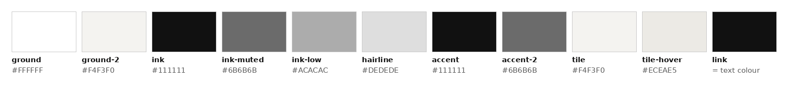
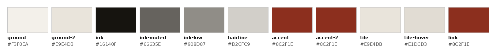
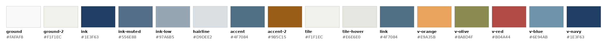

# Themes: colour comparison (prototype only)

Three palettes for the same pages, so the client can choose. **Only colour changes:** type, spacing, images, copy and layout are identical in all three (checked: mono screenshots are pixel-identical to the round-5 build; cream and venues pages have the same heights).
Squarespace will get **one** palette at the end, set in Site Styles (see SQUARESPACE-BUILD-NOTES.md, *Site Styles per theme*).

- **Switcher:** top-right corner of every prototype page (MONO · CREAM · VENUES). The choice is remembered while navigating (localStorage, plus `?theme=` on internal links so it also works where storage is blocked). Any page can be opened in a theme directly, e.g. `index.html?theme=venues`.
- **How it works:** every colour in `site/assets/css/r3.css` is a variable; `data-theme` on `<html>` swaps the set. Generated by `tools/build_themes.py` from the stylesheet.
- **Comparison sheet:** `screenshots/theme-compare.png` (homepage, project row 01 hovered, Room 01 header with chapter 02 active, password page, footer).
- **Rule checked:** every text/ground pair ≥ 4.5:1 (all text on the site that changes colour is under 24px, so 4.5:1 applies throughout; headings are ink).

## Mono (current build, baseline)

| Variable | Value | On ground | Where it's used |
|---|---|---|---|
| `--ground` | `#FFFFFF` | `#FFFFFF` | Page ground: top bar, white sections, case-study meta panel, password page, theme switcher. |
| `--ground-2` | `#F4F3F0` | `#F4F3F0` | Secondary ground: Snippets and Contact sections, the ground behind image tiles, placeholders. |
| `--ink` | `#111111` | `#111111` | Body text, all headings, 1px ink rules (chapter index, contact, video captions), outline button, password field rule. |
| `--ink-muted` | `rgba(17,17,17,.62)` | `#6B6B6B` | 11px caps labels, figure captions, footer text, password error, inactive switcher buttons. |
| `--ink-low` | `rgba(17,17,17,.35)` | `#ACACAC` | Non-text only: the dashed placeholder border. |
| `--hairline` | `rgba(17,17,17,.14)` | `#DEDEDE` | Non-text only: hairline rules (top bar, project rows, panels, footer), inactive slideshow dots. |
| `--accent` | `#111111` | `#111111` | = ink. Enter button fill. (Mono has no active-chapter state.) |
| `--accent-2` | `rgba(17,17,17,.62)` | `#6B6B6B` | = ink-muted. Section index numbers (project 01–04, chapter numbers) and the PASSWORD PROTECTED marker. |
| `--tile` | `#F4F3F0` | `#F4F3F0` | Logo tile ground (homepage project rows, Projects grid). |
| `--tile-hover` | `#ECEAE5` | `#ECEAE5` | Logo tile ground on row/card hover. |
| `--link` | `currentColor` | — | Link underline = the link's own text colour (currentColor), as built. |

**Contrast (text)**

| Pair | Text | Ground | Ratio | Needs | Result |
|---|---|---|---|---|---|
| Body text, headings | `--ink` #111111 | `ground` #FFFFFF | **18.88:1** | 4.5:1 | pass |
| Body text in Snippets / Contact | `--ink` #111111 | `ground-2` #F4F3F0 | **17.02:1** | 4.5:1 | pass |
| Labels, captions, footer (11px) | `--ink-muted` #6B6B6B | `ground` #FFFFFF | **5.33:1** | 4.5:1 | pass |
| Labels in Snippets / Contact (11px) | `--ink-muted` #676766 | `ground-2` #F4F3F0 | **5.10:1** | 4.5:1 | pass |
| Index numbers, lock marker (11–14px) | `--accent-2` #6B6B6B | `ground` #FFFFFF | **5.33:1** | 4.5:1 | pass |
| Active chapter (14px) | `--accent` #111111 | `ground` #FFFFFF | **18.88:1** | 4.5:1 | pass |
| Enter button text (14px) | `--on-accent` #FFFFFF | `accent` #111111 | **18.88:1** | 4.5:1 | pass |

Non-text (decorative, informative only; never carries meaning): Hairline rules `--hairline` #DEDEDE = 1.35:1; Placeholder border `--ink-low` #ACACAC = 2.27:1.

## Cream

| Variable | Value | On ground | Where it's used |
|---|---|---|---|
| `--ground` | `#F3F0EA` | `#F3F0EA` | Page ground: top bar, white sections, case-study meta panel, password page, theme switcher. |
| `--ground-2` | `#E9E4DB` | `#E9E4DB` | Secondary ground: Snippets and Contact sections, the ground behind image tiles, placeholders. |
| `--ink` | `#16140F` | `#16140F` | Body text, all headings, 1px ink rules (chapter index, contact, video captions), outline button, password field rule. |
| `--ink-muted` | `rgba(22,20,15,.64)` | `#66635E` | 11px caps labels, figure captions, footer text, password error, inactive switcher buttons. |
| `--ink-low` | `rgba(22,20,15,.45)` | `#908D87` | Non-text only: the dashed placeholder border. |
| `--hairline` | `rgba(22,20,15,.15)` | `#D2CFC9` | Non-text only: hairline rules (top bar, project rows, panels, footer), inactive slideshow dots. |
| `--accent` | `#8C2F1E` | `#8C2F1E` | Wine. Enter button fill and the active chapter in the index. |
| `--accent-2` | `#8C2F1E` | `#8C2F1E` | Wine. Section index numbers (project 01–04, chapter numbers) and the PASSWORD PROTECTED marker. |
| `--tile` | `#E9E4DB` | `#E9E4DB` | Logo tile ground (homepage project rows, Projects grid). |
| `--tile-hover` | `#E1DCD3` | `#E1DCD3` | Logo tile ground on row/card hover. |
| `--link` | `#8C2F1E` | `#8C2F1E` | Wine. Link underlines and the current nav item's underline only; link text stays ink. |

**Contrast (text)**

| Pair | Text | Ground | Ratio | Needs | Result |
|---|---|---|---|---|---|
| Body text, headings | `--ink` #16140F | `ground` #F3F0EA | **16.18:1** | 4.5:1 | pass |
| Body text in Snippets / Contact | `--ink` #16140F | `ground-2` #E9E4DB | **14.53:1** | 4.5:1 | pass |
| Labels, captions, footer (11px) | `--ink-muted` #66635E | `ground` #F3F0EA | **5.26:1** | 4.5:1 | pass |
| Labels in Snippets / Contact (11px) | `--ink-muted` #625F58 | `ground-2` #E9E4DB | **5.03:1** | 4.5:1 | pass |
| Index numbers, lock marker (11–14px) | `--accent-2` #8C2F1E | `ground` #F3F0EA | **7.27:1** | 4.5:1 | pass |
| Active chapter (14px) | `--accent` #8C2F1E | `ground` #F3F0EA | **7.27:1** | 4.5:1 | pass |
| Enter button text (14px) | `--on-accent` #FFFFFF | `accent` #8C2F1E | **8.27:1** | 4.5:1 | pass |

Non-text (decorative, informative only; never carries meaning): Hairline rules `--hairline` #D2CFC9 = 1.37:1; Placeholder border `--ink-low` #908D87 = 2.91:1.

Wine `#8C2F1E` appears only on: section index numbers, the PASSWORD PROTECTED marker, link underlines (and the current nav item's underline), the active chapter in the index, and the Enter button fill. It is never a large fill: the Enter button (~88×44px) is the largest wine area.

## Venues

| Variable | Value | On ground | Where it's used |
|---|---|---|---|
| `--ground` | `#FAFAF8` | `#FAFAF8` | Page ground: top bar, white sections, case-study meta panel, password page, theme switcher. |
| `--ground-2` | `#F1F1EC` | `#F1F1EC` | Secondary ground: Snippets and Contact sections, the ground behind image tiles, placeholders. |
| `--ink` | `#1E3F63` | `#1E3F63` | Body text, all headings, 1px ink rules (chapter index, contact, video captions), outline button, password field rule. |
| `--ink-muted` | `rgba(30,63,99,.75)` | `#556E88` | 11px caps labels, figure captions, footer text, password error, inactive switcher buttons. |
| `--ink-low` | `rgba(30,63,99,.45)` | `#97A6B5` | Non-text only: the dashed placeholder border. |
| `--hairline` | `rgba(30,63,99,.15)` | `#D9DEE2` | Non-text only: hairline rules (top bar, project rows, panels, footer), inactive slideshow dots. |
| `--accent` | `#4F7084` | `#4F7084` | Light blue. Link text, current nav item, active slideshow dot, Enter button fill, active chapter on Home/Projects. |
| `--accent-2` | `#9B5C15` | `#9B5C15` | Orange (used sparingly). Project numbers 01–04 and the PASSWORD PROTECTED marker. Case pages use the room colour instead. |
| `--tile` | `#F1F1EC` | `#F1F1EC` | Logo tile ground (homepage project rows, Projects grid). |
| `--tile-hover` | `#E6E6E0` | `#E6E6E0` | Neutral fallback; each tile actually hovers to a pale tint of its own room colour (table below). |
| `--link` | `#4F7084` | `#4F7084` | Light blue. Link text and its underline. |

**Contrast (text)**

| Pair | Text | Ground | Ratio | Needs | Result |
|---|---|---|---|---|---|
| Body text, headings | `--ink` #1E3F63 | `ground` #FAFAF8 | **10.32:1** | 4.5:1 | pass |
| Body text in Snippets / Contact | `--ink` #1E3F63 | `ground-2` #F1F1EC | **9.52:1** | 4.5:1 | pass |
| Labels, captions, footer (11px) | `--ink-muted` #556E88 | `ground` #FAFAF8 | **5.06:1** | 4.5:1 | pass |
| Labels in Snippets / Contact (11px) | `--ink-muted` #536C85 | `ground-2` #F1F1EC | **4.81:1** | 4.5:1 | pass |
| Index numbers, lock marker (11–14px) | `--accent-2` #9B5C15 | `ground` #FAFAF8 | **5.11:1** | 4.5:1 | pass |
| Active chapter (14px), links, current nav | `--accent` #4F7084 | `ground` #FAFAF8 | **5.04:1** | 4.5:1 | pass |
| Enter button text (14px) | `--on-accent` #FFFFFF | `accent` #4F7084 | **5.27:1** | 4.5:1 | pass |
| Contact links (17px) on Contact ground | `--accent` #4F7084 | `ground-2` #F1F1EC | **4.65:1** | 4.5:1 | pass |
| Room 01 · olive: chapter numbers, FIG. numbers, active chapter | `--room` #6D6F41 | `ground` #FAFAF8 | **5.02:1** | 4.5:1 | pass |
| Room 02 · orange: chapter numbers, FIG. numbers, active chapter | `--room` #9B5C15 | `ground` #FAFAF8 | **5.11:1** | 4.5:1 | pass |
| Room 03 · light blue: chapter numbers, FIG. numbers, active chapter | `--room` #4F7084 | `ground` #FAFAF8 | **5.04:1** | 4.5:1 | pass |
| Room 04 · red: chapter numbers, FIG. numbers, active chapter | `--room` #A8443F | `ground` #FAFAF8 | **5.64:1** | 4.5:1 | pass |

Non-text (decorative, informative only; never carries meaning): Hairline rules `--hairline` #D9DEE2 = 1.30:1; Placeholder border `--ink-low` #97A6B5 = 2.38:1.

**The five venue colours.** Sampled from the business card (`references/business-card.png`) and refined to web values. Each has a **fill** value (the card colour, used for the stripe and the tile-hover tints, never for text) and, where it is used for text, a darker **text-safe** value that passes 4.5:1:

| Venue | Fill (stripe) | Text-safe | Used for |
|---|---|---|---|
| Orange (Henry Ford Museum) | `#E9A35B` | `#9B5C15` | Project numbers, lock marker; Room 02 marks |
| Olive (Greenfield Village) | `#8A8D4F` | `#6D6F41` | Stripe; Room 01 marks; Room 01 tile hover |
| Red (Ford Rouge Factory Tour) | `#B04A44` | `#A8443F` | Stripe; Room 04 marks; Room 04 tile hover |
| Light blue (Benson Ford Research Center) | `#6E94AB` | `#4F7084` | Links, active states, Enter button; Room 03 marks |
| Navy (Henry Ford Academy) | `#1E3F63` | `#1E3F63` | Ink: all text, rules |

**Per-room colour** (case-study pages only; small elements: chapter numbers, chapter-index numbers, FIG. numbers, the active chapter). Headers stay on the light ground. Each project's logo tile hovers to a pale tint of its room colour:

| Room | Text colour | Tile hover tint |
|---|---|---|
| Room 01 · olive | `#6D6F41` | `#DADBC9` |
| Room 02 · orange | `#9B5C15` | `#EFE0CC` |
| Room 03 · light blue | `#4F7084` | `#D4DDDE` |
| Room 04 · red | `#A8443F` | `#E3CCC7` |

**Signature stripe:** one 4px rule in five equal segments (orange · olive · red · light blue · navy, fill values). On the homepage it appears exactly twice: under the hero (replacing the full-width hairline there) and above the footer (replacing the footer rule, at the content width). Other pages have no hero, so they show only the footer stripe. It overlays the rule it replaces and takes no space.
No coloured section backgrounds, headings or bands. Logos stay in colour on the secondary ground.

**Deviation from the brief:** muted ink is **75%** of navy, not 64%. At 64% it measures 3.79:1 on `#FAFAF8` and 3.65:1 on `#F1F1EC` (fails 4.5:1 at 11px); 75% gives 5.06:1 and 4.81:1. Low ink stays at 45% and is used for non-text only.
